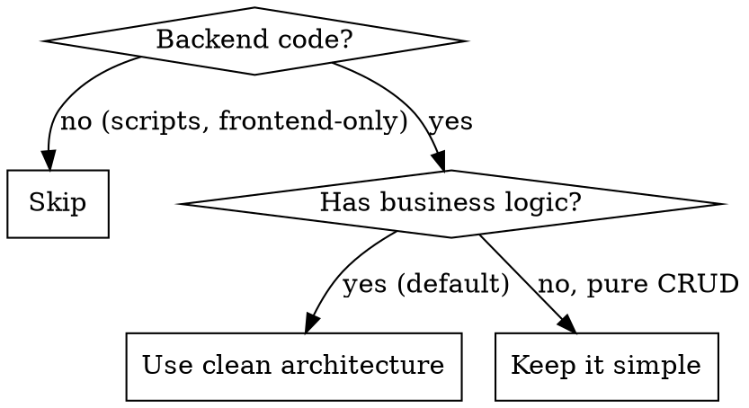

# Clean Architecture

## Overview

**Business logic stays pure, infrastructure stays outside.**

All three patterns (Clean, Hexagonal, Onion) share one rule: **dependencies point inward**. Domain knows nothing about HTTP, databases, or frameworks.

## When to Use

**Default: ON for any backend code with business logic.**

**Use when (any of these):**
- Writing or modifying backend services, APIs, or domain models
- Business rules exist (validation, calculations, state transitions)
- Rules need testing without infrastructure
- Multiple entry points (API, CLI, queue, events)
- External systems may change (payment providers, DBs)

**Skip when:**
- Pure CRUD with no business logic
- Simple scripts or utilities
- Prototypes / throwaway code
- Frontend-only code

## Rule Categories

| Priority | Category | Rules |
|----------|----------|-------|
| CRITICAL | Core Concepts | `core-concepts.md` |
| CRITICAL | Ports and Adapters | `ports-and-adapters.md` |
| CRITICAL | Domain Model | `domain-model.md` |
| HIGH | Use Cases | `use-cases.md` |
| HIGH | Dependency Injection | `dependency-injection.md` |
| MEDIUM | Testing Strategy | `testing-strategy.md` |
| MEDIUM | Common Mistakes | `common-mistakes.md` |

## Quick Reference (Red Flags)

| Smell | Problem | Fix |
|-------|---------|-----|
| `import { Repository } from 'typeorm'` in domain | ORM in domain | Define own interface |
| Business rule in controller | Logic in wrong layer | Move to domain entity/service |
| `if (dto.type === 'X')` in use case | Business logic leaked | Move to domain |
| Entity is just data + getters | Anemic domain model | Add behavior methods |
| 10 interfaces for CRUD endpoint | Over-engineering | Simplify, add abstraction when needed |
| Can't test rule without DB | Coupled domain | Extract pure function/method |

## Quick Checklist

Before committing code with business logic:

- [ ] Domain entities have behavior, not just data
- [ ] Business rules testable without DB/HTTP
- [ ] No framework imports in domain layer
- [ ] Use case orchestrates, doesn't contain business logic
- [ ] Ports defined by what domain needs, not what infrastructure provides
- [ ] Value objects for domain concepts (Money, Email, OrderId)

## How to Use

Rules are in the `rules/` folder. Each follows `rules/_template.md` format.

When designing or refactoring services, check rules by priority (CRITICAL first). Apply all applicable rules.
