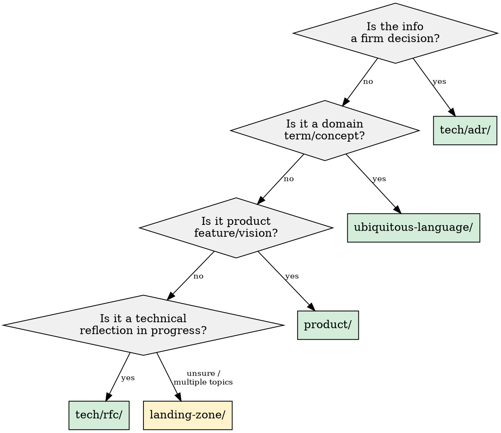

# Knowledge Management

## Overview

**Every conversation must produce documentation.** When valuable knowledge surfaces — a decision, a term, a feature idea, an unresolved debate — it must be captured before the conversation ends. Knowledge that isn't documented is lost.

This skill ensures it lands in the right place and stays discoverable. Root: `docs/`.

## Core Principle

At the end of any conversation where knowledge surfaced, ask: *"What did I learn that future-me or a teammate can't derive from the code?"* That answer becomes one of:
- An **ADR** (firm decision)
- An **RFC** (ongoing debate)
- A **ubiquitous language entry** (domain term)
- A **product doc** (feature/vision)
- A **landing-zone entry** (unclear where it goes yet — but capture it anyway)

## When to Use

- Conversation reveals an architectural decision, trade-off, or constraint
- A domain term is defined, clarified, or corrected
- A product feature, vision element, or requirement is discussed
- Information surfaces but doesn't clearly fit a category yet
- You need to create, update, or reorganize documentation
- **NOT** for code comments or inline docs — those live in code

## Documentation Structure

```
docs/
├── tech/                          # Technical documentation
│   ├── README.md                  # Index of all tech docs
│   ├── adr/                       # Architecture Decision Records
│   │   ├── README.md              # ADR index
│   │   └── NNNN-slug.md           # Individual ADRs
│   └── rfc/                       # In-progress reflections
│       ├── README.md              # RFC index
│       └── NNNN-slug.md           # Individual RFCs
├── product/                       # Product documentation
│   ├── README.md                  # Index
│   └── <topic>.md
├── landing-zone/                  # Unclassified, in-progress
│   ├── README.md                  # Index
│   └── <topic>.md
└── ubiquitous-language/           # Domain language definitions
    ├── README.md                  # Index (also the glossary)
    └── <term>.md                  # Deep-dive per term (optional)
```

## Classification Decision



**When in doubt → `landing-zone/`.** It's better to capture imperfectly than to lose information. Landing-zone entries get promoted once clarity emerges.

## Formats

### ADR (Architecture Decision Record)

File: `docs/tech/adr/NNNN-slug.md`

**Before creating:** check existing ADRs to determine next number. `ls docs/tech/adr/`

```markdown
# NNNN - Title

**Status:** Proposed | Accepted | Deprecated | Superseded by [NNNN]
**Date:** YYYY-MM-DD

## Context

Why this decision is needed. What forces are at play.

## Decision

What we decided. Be specific.

## Rationale

Why we chose this over alternatives. The reasoning that tipped the scale.

## Alternatives Considered (optional)

Brief description of discarded options and why they were rejected.

## Consequences

What follows from this decision — both positive and negative.
```

### RFC (Request for Comments)

File: `docs/tech/rfc/NNNN-slug.md`

**Before creating:** check existing RFCs for next number. `ls docs/tech/rfc/`

**Lifecycle:** RFC → once decided → create ADR + mark RFC as `Decided → ADR-NNNN`

```markdown
# NNNN - Title

**Status:** Open | Decided → ADR-NNNN | Abandoned
**Date:** YYYY-MM-DD

## Problem

What we're trying to solve.

## Options

### Option A — Name
Pros / Cons

### Option B — Name
Pros / Cons

## Open Questions

- Unresolved points
```

### Ubiquitous Language Entry

For simple terms, add directly to `docs/ubiquitous-language/README.md` glossary table.
For complex terms needing deep-dive, create `docs/ubiquitous-language/<term>.md` and link from README.

```markdown
# Term

## Definition

One clear sentence.

## Context

Why this term matters, what it replaces, common confusions.

## Examples

Concrete usage in our domain.
```

### Product Documentation

File: `docs/product/<topic>.md` — no rigid template, adapt to content.

### Landing Zone

File: `docs/landing-zone/<topic>.md` — freeform. Add a `**Status:**` line and `**Potential destinations:**` to track where it might move.

## Index Files (README.md)

**Every section MUST have a README.md acting as an index.** This is the primary discovery mechanism.

Format — a simple table or list linking to all entries with one-line descriptions:

```markdown
# Section Name

| Entry | Description |
|-------|-------------|
| [NNNN-slug](NNNN-slug.md) | One-line summary |
```

**Update the index every time you add, rename, or remove a document.** An undiscoverable document is a lost document.

## Red Flags — STOP and Fix

- Creating a document without updating its section's README.md
- Inventing ADR/RFC numbers without checking existing ones (`ls` first)
- Classifying uncertain information into a specific category instead of landing-zone
- Using `.docs/` instead of `docs/`
- Writing verbose prose when a table or short paragraph suffices
- Skipping the `Status` field on ADRs, RFCs, or landing-zone entries

## Common Mistakes

| Mistake | Fix |
|---------|-----|
| Putting everything in `tech/adr/` | Only firm decisions are ADRs. Debates → `rfc/`, unclear → `landing-zone/` |
| Forgetting README.md updates | Always update the section index after creating/modifying docs |
| Inventing doc numbers | `ls` the directory first to find the next available number |
| Over-documenting in one pass | Capture the essence concisely. Docs can be enriched later |
| Never promoting from landing-zone | Periodically review landing-zone and promote entries that have clarity |
